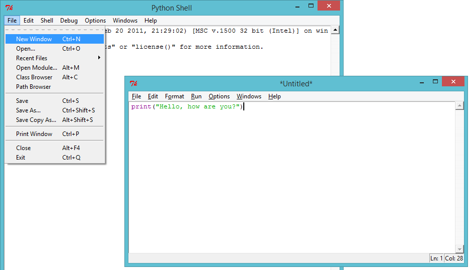
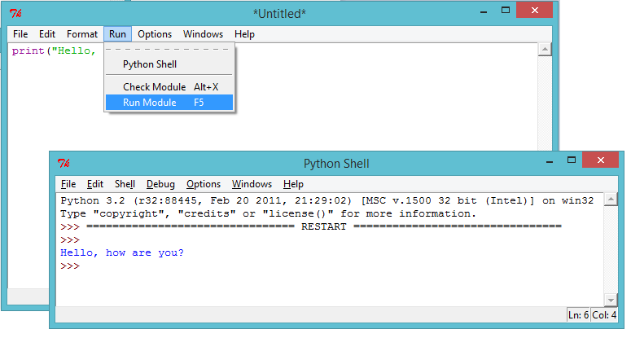
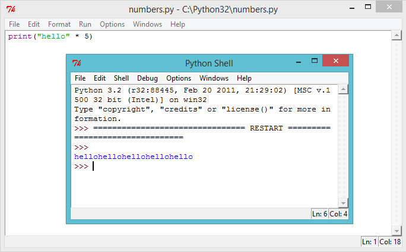
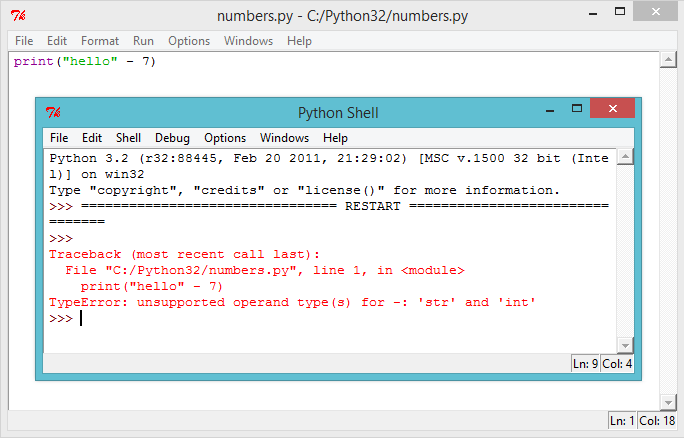
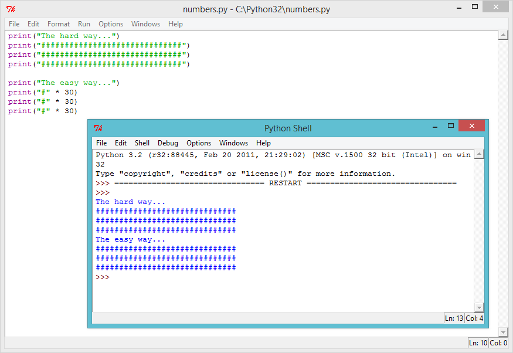

---
title: ASCII Art
level: Python 1
language: uk-UA
stylesheet: python
embeds: "*.png"
materials: ["Project Resources/*.*"]
...

# Вступ: {.intro}

Python дозволяє перетворити ряд інструкцій в корисні програми і веселі ігри! У цьому проекті ви дізнаєтеся, як запустити програму на Python, і як надрукувати текст на екрані.

# Крок 1: привітатися {.activity}
## Контроль активності { .check}

+ Давайте почнемо з написання дуже простої  програми, просто аби ви дізналися, як запустити програму на Python. Відкрийте редактор програм IDLE:
    + В операційній системі Windows, знайти IDLE в стартовому меню;
    + На Mac, відкрийте Terminal.app і введіть `idle` і натисніть Enter;
    + В Linux, відкрийте термінал і введіть `idle` і натисніть клавішу Enter.

+ Натисніть `File → New Window`, а потім введіть команду у вікні:

    ```python
    print("Привіт, як ти?")
    ```

    Ця програма буде друкувати текст на екрані. Зверніть увагу на те, що текст, який ви хочете надрукувати, оточений лапками (`" `). Ось зображення, що показує, що вам потрібно зробити:

    

+ Збережіть файл, натиснувши `File → Save`, і назвіть файл `hello.py` або щось подібне. Не забудьте ввести `.py` в кінці, що говорить комп'ютеру, що це файл Python. Без цього ваша програма не буде підсвічена кольором, що може бути дуже корисним.

    

+ Запустіть файл, натиснувши кнопку `Run → Run module`. Ви повинні побачити інше вікно, яке є оболонкою Python. Це місце, де буде працювати ваша програма. Якщо все працює правильно, ви повинні побачити ваш текст на екрані.

    

+ Якщо ви допустили помилку, наприклад, пропустили лапку (`"`), то ви отримаєте повідомлення про помилку, що, каже вам, що пішло не так! Спробуйте!

    

+ Вітаю, ви тепер офіційно Python програміст! Попленйскайте себе по спині (або якщо ви відчуваєте себе ледачим, попросіть кого-небудь зробити це для вас).

## Збережи проект {.save}

## Завдання: Що в тебе на думці? {.challenge}
Змініть програму вище, щоб надрукувати що-небудь більш цікаве на екрані!


## Збережи проект {.save}

# Крок 2: Про себе { .activity .new-page}
## Контроль активності { .check}

+ Давайте надрукуємо щось набагато більше веселе, ніж текст... ASCII мистецтво! ASCII - це мистецтво створення картин з тексту. Ось приклад - це має бути собака!

    

    Для того, щоб зробити цей шедевр, ви можете ввести наступний текст в редакторі IDLE і запустити програму

    ```python
    print("A picture of a dog...")
    print(" 0____  ")
    print("  ||||  ")
    ```

+ Якщо ви віддаєте перевагу, ви можете використовувати 3 одиничні лапки (`'''`) замість лапок, який дозволяє надрукувати кілька рядків тексту з 1 оператором print. Наприклад:

    ```python
    print('''
    A picture of a dog...
     0____
      ||||
    ''')
    ```

    Якщо ви запустите цю програму, ви побачите, що вона друкує ту ж собаку, як і раніше.

## Збережи проект {.save}

## Завдання: Про себе { .challenge}
Напишіть програму на мові Python, щоб розповісти іншим про себе, використовуючи текст і ASCII-арт. Ви можете створювати картинки свого хобі, друзів, сім'ї ... все, що ви хочете! Ось приклад:


## Збережи проект {.save}

# Крок 3: Текстові розрахунки { .activity}
## Контроль активності { .check}

+ Python також може зробити розрахунки за допомогою тексту! Що ви отримаєте, якщо ви примножуєте `"привіт"` на 5? Давайте запитаємо Python, запустивши цю програму:

    ```python
    print("привіт" * 5)
    ```

    Зірка `*` в програмі вище, є знаком множення. Запустіть програму вище, і ви повинні побачити відповідь:

    

+ Ви можете зробити друкований текст вище легшим для читання, поставивши пробіл після слова `"привіт"` у вашій програмі:

    ```python
    print("привіт " * 5)
    ```
    Запустивши цю програму, ви побачите, що вивід трохи легше читати, ніж раніше.

+ Якщо `"привіт "` помножити на 5 буде `"привіт привіт привіт привіт привіт "`, то що значить `"привіт "- 7`? Чи має цей розрахунок сенс?

    

    На жаль, ви зламали! Замість відповіді, ми отримуємо повідомлення про помилку. Схоже, що розрахунок не має сенсу в Python!

+ Як щодо того? Яку відповідь ви думаєте, `"привіт "+" світ`" дасть? Спробуйте, виконавши наступну програму:

    ```python
    print("привіт " + "світ")
    ```

    

    це дасть вам відповідь, яку ви очікували?

## Збережи проект {.save}

## Завдання: Слова і числа {.challenge}
Що надрукує наступна програма на екрані? Ви зможете здогадатися правильно перед запуском програми.

```python
print("ха "*4)
print("ba" + "na"*2)
print("He" + "l"*2 + "o" + "!"*10)
```

Чи зможете ви зробити будь-які слова самостійно?

## Збережи проект {.save}

# Крок 4: шаблони ASCII { .activity}
## Контроль активності { .check}

+ Тепер, коли ви знаєте, як зробити розрахунки з текстом, що тепер? Чому це корисно? Ну, скажімо, ви хотіли намалювати ASCII Art прямокутник, який становить 30 символів в довжину і 3-х символів в висоту. Ви можете або зробити це важким способом:

    ```python
    print("##############################")
    print("##############################")
    print("##############################")
    ```

    Або ви могли б заощадити час і зробити це легким шляхом:

    ```python
    print("#" * 30)
    print("#" * 30)
    print("#" * 30)
    ```

    Обидва дають вам однакові прямокутники, виведені на екран:

    

+ Можна навіть використовувати розрахунки, щоб зробити цікаві моделі, як ця хвиля:

    ```python
    print("/\  "*10)
    print("  \/"*10)
    ```

    

## Збережи проект {.save}

## Завдання: Программа шарф { .challenge}
Ваш найкращий друг, який святкує 11-й день народження, і в якості подарунка ви вирішили написати йому шарф! Використовуйте розрахунки, де це можливо, щоб зробити свій власний шаблон шарфу.

Якщо ви відчуваєте себе щедрим, ви могли б навіть написати йому торт (в тому числі 11 свічок), щоб взяти його з собой!


## Збережи проект {.save}
