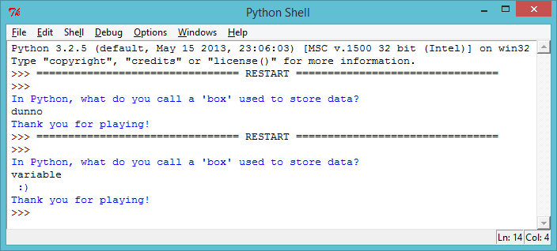
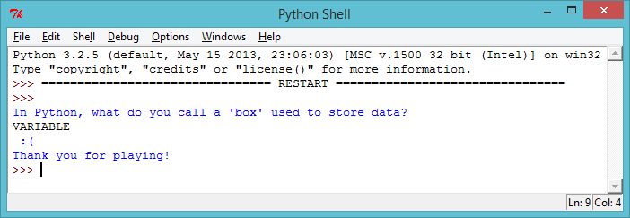

---
title: Quiz
level: Python 1
language: uk-UA
stylesheet: python
embeds: "*.png"
materials: ["Project Resources/Quiz.py"]
...

# Вступ: {.intro}

У цьому проекті, ти зробиш вікторини, щоб змагатися зі своїми друзями.

# Крок 1: Ставлячи питання {.activity}

## Контроль активності { .check}

+ Давайте почнемо з написання дуже простої вікторини, яка задає гравцеві питання, а потім показує їм смайлики, якщо вони ввели правильну відповідь.

	```python
	print("Як в Python називається комірка, що використовують для зберігання данних?")
	answer = input()

	if answer == "змінна":
		print(" :) " * 100)

	print("Дякую за гру!")
	```

	Не забудьте двокрапку ( `:`) в кінці рядка `if answer == "variable":`. І вирівняти рядок нижче(перемістити його вправо) за допомогою пробілів.

+ Після того, як ви написали програму вище, спробуйте! Що відбувається, коли ви даєте правильну відповідь? Що відбувається, коли ви робите помилку?

	

	Код з відступомс (який друкує смайлики) працює тільки, якщо *if* відповідь правильна. Але "Дякую за гру!" з'являється завжди, чи ваша відповідь є правильним чи неправильним. Чому це так?

	Python використовує два знака рівності `==`, щоб перевірити, що дві речі однакові. Це тому, що один знак рівності `=` використовується для зберігання чогось в змінній (наприклад, `answer = input()`).


+ Програма вище друкує смайлики, якщо гравець дає правильну відповідь, але нічого не каже, якщо вони помилилися. Ви можете використовувати `else` для друку сумних обличчь, якщо користувач вводить щось інше, крім правильної відповіді.

	```python
	print("Як в Python називається комірка, що використовують для зберігання данних?")
	answer = input()

	if answer == "змінна":
		print(" :) " * 100)
	else:
		print(" :( " * 100)

	print("Дякую за гру!")
	```

	Спробуйте цю нову програму. Що відбувається, коли ви вводите правильну відповідь? Що відбувається, коли ви вводите що-небудь ще?

	

## Збережи проект {.save}

## Завдання: Час питаннь {.challenge}

Use what you've learnt so far to create your own quiz. You can choose any topic you like, and your quiz should use `if` and `else` statements to let the player know how they're doing.

Використовуйте те, що ви дізналися досі, щоб створити свою власну вікторину. Ви можете вибрати будь-яку тему, яку ви любите, і ваш тест повинен використовувати `if` і `else`, щоб дозволити гравцеві знати, що вони роблять.

## Збережи проект {.save}

# Крок 2: Тестування {.activity}

Це завжди гарна ідея перевірити свої програми, щоб переконатися, що вони працюють належним чином.

## Контроль активності { .check}

+ Якщо ви тестували свою вікторину, ви, можливо, помітили, що можна отримати сумні обличчя навіть тоді, коли ви вводите правильну відповідь! Як і в цьому прикладі, де гравець випадково натиснувCAPS LOCK!

	

	This happens because Python is very strict when it compares the player's answer to the correct answer. To Python, "V" isn't the same as "v", and so if the player uses any capital letters in their answer, Python thinks the answer's wrong!
	
	Це відбувається тому, що Python є дуже строгим, коли він порівнює відповідь гравця з  правильною відповіддю. Для Python, "V" не те ж саме, що "v", і тому, якщо гравець використовує будь-які великі літери в своїй відповіді, Python думає, що відповідь не вірна!

	Перевірте це у вашій грі, щоб побачити, що теж саме відбувається.

+ Щоб усунути цю проблему, необхідно перетворити відповідь гравця в нижній регістр, аби небуло ніяких великих літер в їх відповіді. Ми можемо переконатися, що це працює, надрукувавши модифіковану відповідь. Заміни код, де гравець вводить свою відповідь:

	```python
	answer = input().lower()
	print(answer)
	```

+ Тепер перевірте вашу вікторину ще раз. Ви виправили проблему? Спробуйте протестувати ці приклади:

	

## Збережи проект {.save}

# Крок 3: Множинний вибір {.activity}

## Контроль активності { .check}

+ До сих пір ви використовували `if` і `else`, щоб дозволити гравцеві знати, якщо він дав правильну відповідь або неправильно. Але що, якщо ви хочете кілька варіантів відповіді, в якому користувач може побачити один з 4-х варіантів відповіді? Ви можете використовувати `elif`, щоб зробити це.

	```python
	print("")
	answer = input()

	print('''
	П1 - Як в Python називається комірка, що використовують для зберігання данних?
	а - текст
	б - змінна
	в - коробка для взуття
	''')
	answer = input().lower()

	if answer == "а":
		print(" Ні, текст - це тип данних :( ")
	elif answer == "б":
		print(" Вірно!! :) ")
	elif answer == "в":
		print(" Не клей дурня! :( ")
	else:
		print(" Ти не видбрав а, б чи в :( ")
	```

	 is short for "else if". So in the program above, the player sees one of 4 messages, depending on what they entered for their answer.

	`elif` це скорочення від "else if". Таким чином, у наведеній вище програмі, гравець бачить одне з 4 повідомлень, в залежності від того, що вони ввели у відповідь.

+ Додати код вище до вашої вікторини, так що у вас буде кілька питання вибору.

+ Перевірте нове питання 4 рази, так що ви бачите кожне з 4 повідомлень.

	

## Збережи проект {.save}

## Завдання: Множинний вибір вікторини {.challenge}

Add a few multiple choice questions to your quiz program. Once you have finished making your quiz, get someone else to play it! How did they do? Did they enjoy it? Was it too easy or too hard?


Додайте кілька питань з множинного вибору для вашої вікторини. Після того, як ви закінчили робити, попросіть кого-небудь, щоб  пограв! Як вони це робили? Можливо, їм це подобається? Це було занадто легко або дуже складно?

## Збережи проект {.save}

## Завдання: Збереження оцінки {.challenge}

Ви можете використовувати змінну `score` в вашій програмі, щоб стежити за рахунок гравця? Як можна було б використовувати змінну:

+ На початку програми, встановіть `score` в 0.
+ Щоразу, коли гравець правильно відповів, додайте 1 до рахунку гравця. ( `score = score + 1`)
+ Надрукуйте рахунок гравця в кінці вікторини.

## Збережи проект {.save}

## Завдання: Як я пройшов? {.challenge}

Чи можете ви надрукувати персоналізовані повідомлення для гравця в кінці гри?

+ Say "well done" `if` they got all of the questions right.
+ Скажи "молодець" `if` вони відповіли правильно на всі питання.
+ скажи "спробуйте ще раз", якщо вони помилилися.

(Ви повинні будете використовувати змінну `score`, щоб вирішити, яке повідомлення друкувати!)

## Збережи проект {.save}
